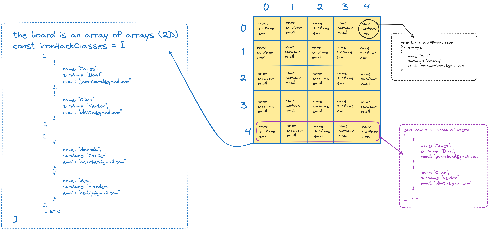

# OBJECTS, ARRAYS AND TESTING

In this class we've learned about objects, arrays and testing.
Check the JS files to see all the exercises we've done in class.

## How to see JASMINE's exercises?
All jasmine exercises are in the `testing-with-jasmine` folder.
The folder `src` contains the source code (where we created our functions) and the folder `spec` contains the tests.

### How to run the jasmine tests?
Open the SpecRunner.html file in your browser with LIVE SERVER and check the console for the results.

### I've created a spec file and it's not running. What should I do?
Check the SpecRunner.html file and make sure you've added your spec file in the list of files to be loaded.
```html
<head>
<!--THE REST OF THE CODE INSIDE HEAD-->

<!-- include source files here... -->
  <script src="src/cents-to-decimals.js"></script>
<!-- include spec files here... -->
  <script src="spec/cents-to-decimals.spec.js"></script>

</head>
```

## Run JS files with NODE
To run the JS files with NODE, you need to have NODE installed in your computer.
Open the terminal and run the following command:
```bash
node <file-name>.js
```
Example:
```bash
node exercise1.js
```

## Example of 2D array


